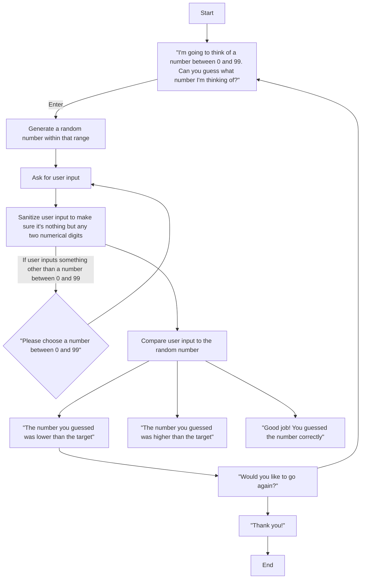

```mermaid

flowchart TD

    Start[Start]-->st1[#quot;I'm going to think of a number between 0 and 99. Can you guess what number I'm thinking of?#quot;];
    st1--Enter-->st1.1[Generate a random number within that range];
    st1.1-->st2[Ask for user input];
    st2-->st3[Sanitize user input to make sure it's nothing but any two numerical digits];
    st3--If user inputs something other than a number between 0 and 99-->st3.1{#quot;Please choose a number between 0 and 99#quot;};
    st3.1-->st2;
    st3-->st4[Compare user input to the random number];
    st4-->lower[#quot;The number you guessed was lower than the target#quot;];
    st4-->higher[#quot;The number you guessed was higher than the target#quot;];
    st4-->correct[#quot;Good job! You guessed the number correctly#quot;];
    lower-->repeat[#quot;Would you like to go again?#quot;];
    repeat-->st1;
    repeat-->stop[#quot;Thank you!#quot;];
    stop-->End[End];

```
