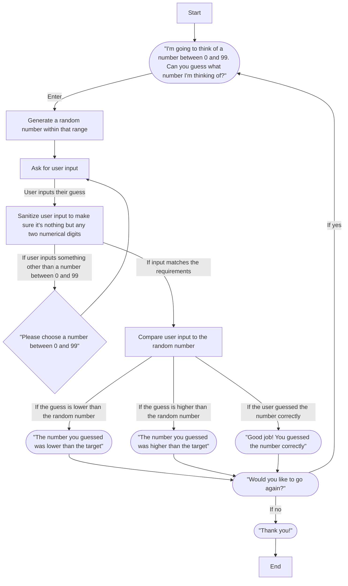

# Documentation

## Start

The start node occurs when we launch the program. It immediately proceeds to the next node.

## Greeting

This node prints a message to greet the user, and defines the rules of the game. When the user presses enter the program proceeds to the next step.

## Generate a random number

At this step the program generates a random number between 0 and 99, then immediately proceeds to the next step. 

## Ask the user for input

At this node, the user is prompted for their input. After the input is recieved the program proceeds to the next step. 

## Sanitize the input

At this node, the program checks the user's input to make sure it is a number between 0 and 99. If it is not, it sends the user back to the node that accepts their input to try again.  
If the  input is acceptable, it proceeds to the next node. 

## Verify the guess

At this node, the program compares the user's input to the randomly generated number. It sends the user to one of three possible nodes, depending on whether the guess was higher, lower, or exactly the same as the randomly generated number. All three of these nodes tell the user how they did and then proceed to the same node.

## Ask if the user wants to play again

The next node asks the user if they would like to try the guessing game again. If they input yes, the program goes back to the Greeting node. If the user inputs no, the program prints "Thank you!" and ends.
