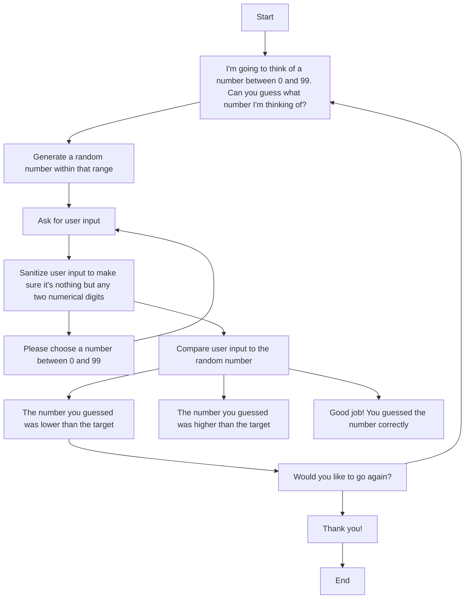

```mermaid

flowchart TD

    Start[Start]-->st1["I'm going to think of a number between 0 and 99. Can you guess what number I'm thinking of?"];
    st1-->st1.1[Generate a random number within that range];
    st1.1-->st2[Ask for user input];
    st2-->st3[Sanitize user input to make sure it's nothing but any two numerical digits];
    st3-->st3.1[Please choose a number between 0 and 99];
    st3.1-->st2;
    st3-->st4[Compare user input to the random number];
    st4-->lower[The number you guessed was lower than the target];
    st4-->higher[The number you guessed was higher than the target];
    st4-->correct[Good job! You guessed the number correctly];
    lower-->repeat[Would you like to go again?];
    repeat-->st1;
    repeat-->stop[Thank you!];
    stop-->End[End];

```
